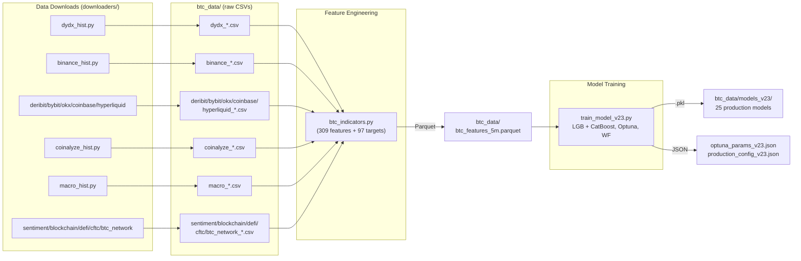
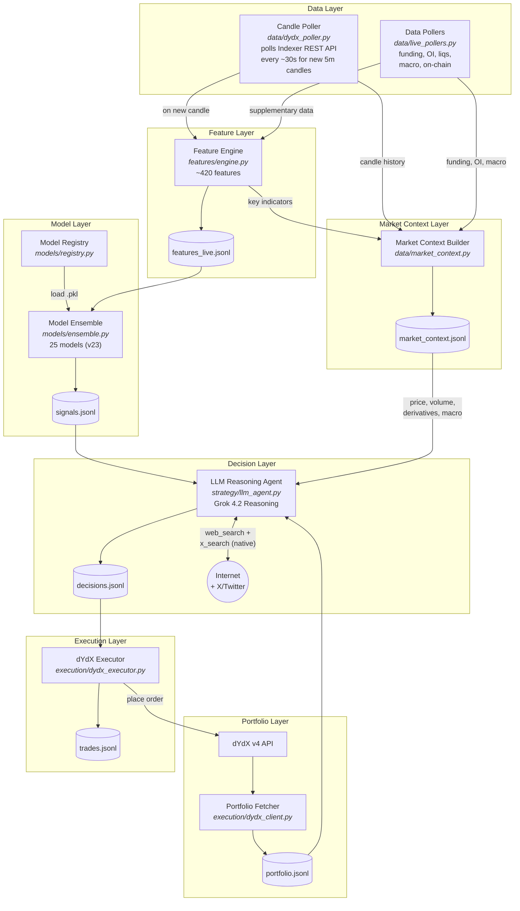

# Hyper Alpha Arena — Trading Pipeline Architecture

> Modular, extensible, observable ML + conventional strategy + LLM trading system for BTC perpetual futures on dYdX v4.

### Closed-Loop Verification

Every module in the pipeline writes its output to a JSONL file in `state_data/` (or `btc_data/` for training). This means the entire pipeline is verifiable by reading these files after a run:

1. **Each module writes before the next reads.** Data flows: candles → `features_live.jsonl` → `signals.jsonl` → `conventional_signals.jsonl` → `market_context.jsonl` → `portfolio.jsonl` → `decisions.jsonl` → `trades.jsonl`. After running the pipeline (even one cycle), check each file to confirm it was written and contains valid data.
2. **Errors are also logged.** Failed steps write to `alerts.jsonl` and `system_health.jsonl` — never silently skip.
3. **Paper mode is the test harness.** Run `python orchestrator.py --mode paper` to execute the full pipeline end-to-end without placing real orders. Then inspect all JSONL files to verify every stage produced correct output.
4. **To verify a single module**, run it in isolation and check its output file. For example: run Feature Engine on historical candles → check `features_live.jsonl`. Run Model Ensemble on those features → check `signals.jsonl`. Each file independently proves that module works.
5. **Training pipeline is the same principle.** Data downloaders write CSVs. Feature engine writes parquet. Trainer writes `.pkl` models and config JSONs. Check these files exist and contain expected data after a training run. **Currently:** `btc_indicators.py` → `btc_data/btc_features_5m.parquet`, `train_model_v23.py` → `btc_data/models_v23/*.pkl` + `production_config_v23.json`.

When implementing: always write output files first, then verify by reading them back, before moving to the next module. If a file is empty or missing after a run, that module is broken.

---

## Data Sources

> Full data source catalog with endpoints, pricing, and free alternatives: **[datasources.md](datasources.md)**

14 downloaders in `downloaders/`, orchestrated by `downloaders/download_all.py`. All free, all writing to `btc_data/` as CSV.

| # | Source | Module | Auth | Status |
|---|--------|--------|------|--------|
| 1 | dYdX v4 Indexer | `dydx_hist.py` | None | Working |
| 2 | Binance Spot+Futures | `binance_hist.py` | None | Working |
| 3 | Deribit | `deribit_hist.py` | None | Working |
| 4 | Bybit | `bybit_hist.py` | None | Working |
| 5 | OKX | `okx_hist.py` | None | Working |
| 6 | Coinbase Premium | `coinbase_premium_hist.py` | None | Working |
| 7 | Hyperliquid | `hyperliquid_hist.py` | None | Working |
| 8 | Coinalyze | `coinalyze_hist.py` | API key | Working |
| 9 | yfinance + FRED | `macro_hist.py` | FRED key | Working |
| 10 | Alternative.me / CoinGecko / Trends | `sentiment_hist.py` | None | Working |
| 11 | mempool.space | `btc_network_hist.py` | None | Working |
| 12 | Blockchain.com | `blockchain_hist.py` | None | Working |
| 13 | DefiLlama | `defi_hist.py` | None | Working |
| 14 | CFTC EDGAR | `cftc_hist.py` | None | Working |

**Why dYdX as primary training data:** We execute on dYdX, so we should train on dYdX price data. dYdX has its own order book, funding rate schedule (hourly), and liquidity profile. Training on Binance data but trading on dYdX introduces execution skew — prices, spreads, and volume differ between venues. Binance data is kept as supplementary features (e.g., Binance–dYdX basis spread, Binance volume as a liquidity proxy, Binance funding rate as cross-exchange signal).

---

## Training Pipeline

Runs periodically (manually triggered) to retrain models on updated historical data from all sources.

> **What already exists (v23 — production-ready):**
> - **`btc_indicators.py`**: Downloads Binance spot+futures 5m OHLCV, computes 309 features (TA, CVD, microstructure, volatility, GARCH, regime, cross-TF, session, higher-order stats) + 97 ML targets (direction, threshold up/down, favorable risk-reward). Outputs `btc_data/btc_features_5m.parquet`.
> - **`train_model_v23.py`**: Full training pipeline — per-target Optuna hyperparameter optimization (reuses v22 params, new Optuna for new targets), LightGBM + CatBoost ensemble (per-model decision), 10-split walk-forward validation with purging. Top-100 feature selection before Optuna. DD circuit breaker backtesting (0.2% DD, 10-candle cooldown), quality-weighted portfolio.
> - **`btc_data/models_v23/`**: 25 production models (.pkl), `optuna_params_v23.json`, `production_config_v23.json` (weights, thresholds, model metadata).
> - **v23 results**: 25 models, 10/10 WF splits positive, Sharpe 3.1, worst DD -0.3%, annualized +461%.
>
> The modules below refactor the existing monolithic scripts into a modular architecture and extend with new data sources. **The core ML pipeline (features + training + models) is proven and working — don't rewrite, wrap and extend.**

| Step | Module | Input | Output | Status |
|------|--------|-------|--------|--------|
| Download all data | `downloaders/download_all.py` | 14 external APIs | 65 CSV files in `btc_data/` | **Working** — all 14 sources operational |
| Compute features | `btc_indicators.py` | Raw CSVs | `btc_features_5m.parquet` (309 features + 97 targets) | **Working** |
| Train models | `train_model_v23.py` | Features parquet | `.pkl` model files + config JSONs | **Working** — 25 production models |

---

## Live Trading Pipeline

Runs continuously. All data fetched via REST API polling. The main loop polls the dYdX Indexer API for completed 5-minute candles, supplementary data fetched via REST polling, features recompute on each **5-minute candle close**, all models score, and the LLM makes the final trading decision.

### Architecture

