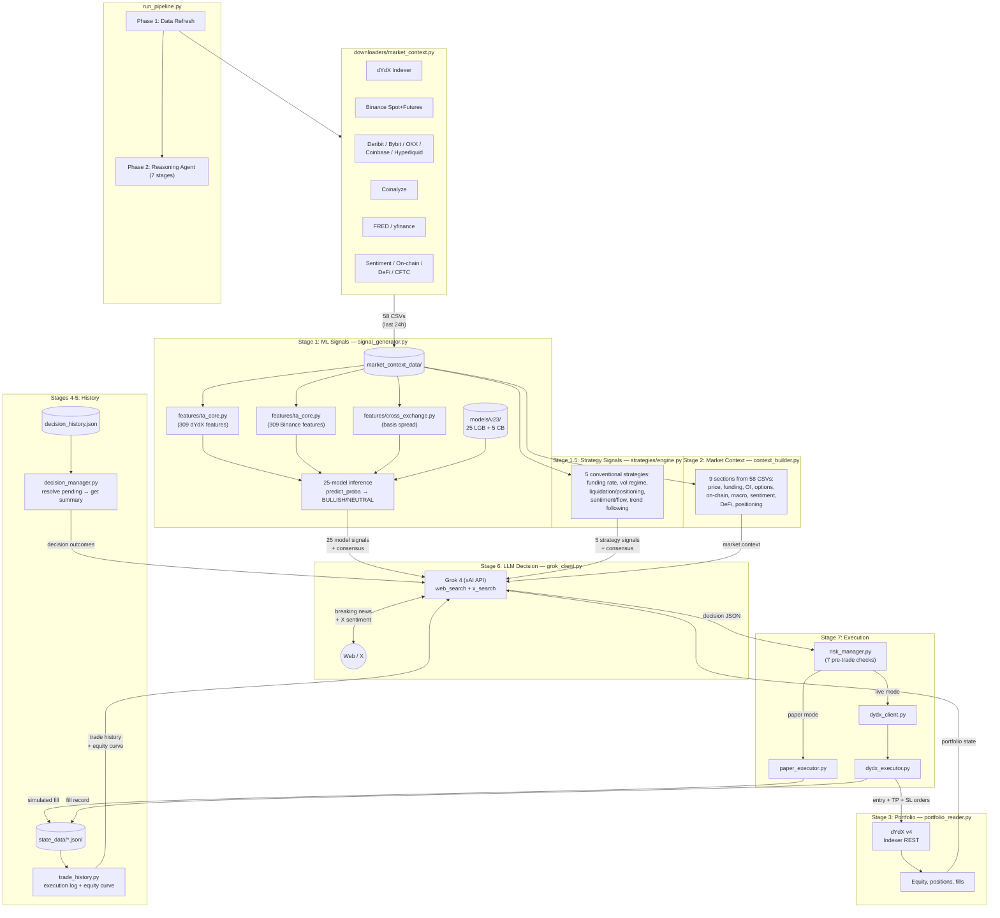

# Trading Pipeline Architecture

> ML ensemble + LLM reasoning + automated execution system for BTC perpetual futures on dYdX v4.

## Repository Layout

```
trading/
├── run_pipeline.py                  # Orchestrator — single entry point for live trading
├── build_dataset.py                 # Feature engineering for training (raw_data → parquet)
├── config/
│   └── settings.yaml                # All configuration (data sources + execution)
├── downloaders/                     # 14 data source downloaders
│   ├── base.py                      #   BaseDownloader with retry, pagination, CSV append
│   ├── download_all.py              #   Historical bulk download orchestrator
│   ├── market_context.py            #   Live context refresh (last 24h → market_context_data/)
│   ├── dydx_hist.py                 #   dYdX v4 Indexer (candles, funding, trades)
│   ├── binance_hist.py              #   Binance spot + futures (klines, funding, OI, L/S)
│   ├── deribit_hist.py              #   Deribit (DVOL, options, IV, funding)
│   ├── bybit_hist.py                #   Bybit (candles, funding, OI)
│   ├── okx_hist.py                  #   OKX (candles, funding, OI, liquidations)
│   ├── coinbase_premium_hist.py     #   Coinbase premium spread
│   ├── hyperliquid_hist.py          #   Hyperliquid (candles, OI)
│   ├── coinalyze_hist.py            #   Coinalyze (OI, funding, L/S, liquidations)
│   ├── macro_hist.py                #   FRED + yfinance (equities, FX, commodities, rates)
│   ├── sentiment_hist.py            #   Fear & Greed, CoinGecko, Google Trends
│   ├── btc_network_hist.py          #   mempool.space (mempool, mining, lightning)
│   ├── blockchain_hist.py           #   Blockchain.com (on-chain metrics)
│   ├── defi_hist.py                 #   DefiLlama (TVL, stablecoin supply)
│   └── cftc_hist.py                 #   CFTC COT reports
├── features/                        # 14 feature engineering modules
│   ├── ta_core.py                   #   ~309 TA features (SMA/EMA, RSI, MACD, Bollinger,
│   │                                #    ATR, volume profile, candle patterns, cross-TF,
│   │                                #    session, zscore, regime, hit rate) + 97 ML targets
│   ├── alignment.py                 #   Timestamp alignment utilities
│   ├── cross_exchange.py            #   Binance–dYdX basis spread, Binance spot alignment
│   ├── funding.py                   #   Funding rate slopes/changes across exchanges
│   ├── open_interest.py             #   OI changes (Binance, Bybit, OKX, Coinalyze)
│   ├── positioning.py               #   L/S ratios, CFTC COT, taker buy/sell
│   ├── volatility_implied.py        #   Deribit DVOL, IV skew, GARCH residuals
│   ├── macro.py                     #   Equities, FX, commodities, rates, BTC correlation
│   ├── sentiment.py                 #   Fear & Greed, market cap momentum
│   ├── onchain.py                   #   Active addresses, hash rate, mempool, fees
│   ├── defi.py                      #   TVL changes, stablecoin supply flow
│   ├── coinalyze.py                 #   Aggregated OI, predicted funding, L/S
│   ├── dydx_trades.py               #   Trade flow velocity, buy/sell imbalance
│   └── liquidations.py              #   Liquidation size/side (OKX, Coinalyze)
├── strategies/                      # 6 conventional trading strategies
│   ├── base.py                      #   BaseStrategy + StrategySignal dataclass
│   ├── engine.py                    #   StrategyEngine — runs all 6, formats for LLM prompt
│   ├── backtest.py                  #   Backtesting framework (walk-forward, metrics, ranking)
│   ├── funding_rate.py              #   Funding Rate Mean Reversion (derivatives leverage)
│   ├── volatility_regime.py         #   Volatility Regime & IV/RV divergence (options)
│   ├── liquidation_flow.py          #   Liquidation Cascade & Positioning (microstructure)
│   ├── sentiment_flow.py            #   Sentiment & Capital Flow (on-chain + sentiment)
│   ├── trend_following.py           #   Multi-Timeframe Trend Following (technical)
│   └── momentum_composite.py       #   Technical Momentum Composite (RSI/MACD/Stoch/BB/Fisher/CCI)
├── model_training/                  # ML model training scripts
│   ├── train_model_v23.py           #   Production trainer (Optuna + LGB + CatBoost + WF)
│   ├── train_v1_all.py              #   Legacy v1 trainer
│   └── train_v2_all.py              #   Legacy v2 trainer
├── models/                          # Trained model artifacts
│   ├── v23/                         #   Production (25 models, 50 .pkl files)
│   │   ├── prod_*_lgb.pkl           #     LightGBM models (25)
│   │   ├── prod_*_cb.pkl            #     CatBoost ensemble models (5)
│   │   ├── production_config_v23.json   # Model metadata, weights, thresholds
│   │   └── optuna_params_v23.json       # Hyperparameter configs
│   ├── v2_all/                      #   Earlier production ensemble
│   └── v1_all/                      #   First iteration
├── llm_agent/                       # LLM reasoning + pipeline stages
│   ├── reasoning_agent.py           #   7-stage main orchestrator
│   ├── signal_generator.py          #   25-model ML inference on live features
│   ├── context_builder.py           #   58-CSV market context aggregator (9 sections)
│   ├── portfolio_reader.py          #   dYdX Indexer REST portfolio query
│   ├── trade_history.py             #   Execution trade log + equity curve reader
│   ├── decision_manager.py          #   Decision persistence + TP/SL outcome tracking
│   └── grok_client.py               #   xAI Grok 4 API wrapper (web_search + x_search)
├── execution/                       # Trade execution layer
│   ├── risk_manager.py              #   7 pre-trade validation checks + circuit breaker
│   ├── paper_executor.py            #   Paper trading (Indexer REST only, no SDK)
│   ├── dydx_client.py               #   Async dYdX v4 SDK wrapper
│   └── dydx_executor.py             #   Live order executor (entry + TP/SL) + CLI
├── raw_data/                        # Historical CSVs (59 files, ~441 MB)
├── processed_data/                  # Training dataset
│   └── btc_training_dataset.parquet #   ~460 features + 97 targets (~240K rows, 714 MB)
├── market_context_data/             # Live context CSVs (58 files, last 24h snapshot)
└── state_data/                      # Execution state (JSONL, append-only)
    ├── decisions.jsonl              #   Every decision passed to execution
    ├── trades.jsonl                 #   Every fill, rejection, failure, alert
    └── portfolio.jsonl              #   Equity/collateral snapshots per cycle
```

---

## Data Sources

14 downloaders in `downloaders/`, all inheriting from `BaseDownloader` with HTTP retry, forward/backward pagination, and CSV append/dedup. Configuration in `config/settings.yaml`. Two orchestrators:

- **`downloaders/download_all.py`** — full historical download into `raw_data/` (59 CSVs, ~441 MB)
- **`downloaders/market_context.py`** — last 24h snapshot into `market_context_data/` (58 CSVs)

| # | Source | Module | Auth | CSV Files |
|---|--------|--------|------|-----------|
| 1 | dYdX v4 Indexer | `dydx_hist.py` | None | candles_5m, funding_rates, market_stats, orderbook_snapshots |
| 2 | Binance Spot+Futures | `binance_hist.py` | None | spot_klines_5m, futures_klines_5m, funding_rates, open_interest, global_ls_ratio, top_ls_accounts, top_ls_positions, taker_buy_sell, index/mark/premium_price_klines |
| 3 | Deribit | `deribit_hist.py` | None | dvol, options_summary, historical_vol, funding_rates, futures_summary |
| 4 | Bybit | `bybit_hist.py` | None | klines_5m, funding_rates, open_interest, ticker_snapshots |
| 5 | OKX | `okx_hist.py` | None | funding_rates, open_interest, liquidations, taker_volume |
| 6 | Coinbase Premium | `coinbase_premium_hist.py` | None | coinbase_premium |
| 7 | Hyperliquid | `hyperliquid_hist.py` | None | market, funding_rates |
| 8 | Coinalyze | `coinalyze_hist.py` | API key | oi_aggregated, oi_daily, funding_rates, funding_daily, long_short_ratio, long_short_ratio_daily, liquidations, liquidations_daily, predicted_funding |
| 9 | yfinance + FRED | `macro_hist.py` | FRED key | equities, fx, commodities, rates, credit, liquidity, crypto_adjacent |
| 10 | Alternative.me / CoinGecko | `sentiment_hist.py` | None | fear_greed, market, google_trends |
| 11 | mempool.space | `btc_network_hist.py` | None | mempool, mining, lightning |
| 12 | Blockchain.com | `blockchain_hist.py` | None | onchain |
| 13 | DefiLlama | `defi_hist.py` | None | tvl, chain_tvl, stablecoin_supply, stablecoin_history |
| 14 | CFTC EDGAR | `cftc_hist.py` | None | cot_bitcoin |

**Why dYdX as primary:** We execute on dYdX, so we train on dYdX price data. dYdX has its own order book, funding schedule (hourly), and liquidity profile. Training on Binance but trading on dYdX introduces execution skew. Binance data is kept as supplementary features (basis spread, volume proxy, cross-exchange signals).

---

## Training Pipeline

Runs manually to retrain models on updated historical data. Three steps, each producing verifiable output files.

```
Step 1: downloaders/download_all.py --full
          │
          ▼
      raw_data/ (59 CSVs from 14 sources, ~441 MB)

Step 2: build_dataset.py
          │
          ├── features/ta_core.py ────────── ~309 dYdX TA features (no prefix)
          ├── features/ta_core.py ────────── ~309 Binance TA features (bnc_ prefix)
          ├── features/cross_exchange.py ─── Binance–dYdX basis spread
          ├── features/funding.py ────────── Funding slopes across exchanges
          ├── features/open_interest.py ──── OI changes (Binance, Bybit, OKX, Coinalyze)
          ├── features/positioning.py ────── L/S ratios, CFTC COT, taker buy/sell
          ├── features/volatility_implied.py  Deribit DVOL, IV skew
          ├── features/macro.py ──────────── Equities, FX, rates, BTC correlation
          ├── features/sentiment.py ──────── Fear & Greed, market cap momentum
          ├── features/onchain.py ────────── Hash rate, addresses, mempool
          ├── features/defi.py ───────────── TVL, stablecoin supply flow
          ├── features/coinalyze.py ──────── Aggregated OI, predicted funding
          ├── features/dydx_trades.py ────── Trade flow velocity
          ├── features/liquidations.py ───── Liquidation size/side
          └── features/ta_core.compute_targets() ── 97 ML targets
          │
          ▼
      processed_data/btc_training_dataset.parquet
      (~460 features + 97 targets, ~240K rows, 714 MB)

Step 3: model_training/train_model_v23.py
          │
          ├── Phase 0: Per-target top-100 feature selection
          ├── Phase 1: Optuna hyperparameter optimization (new targets only)
          ├── Phase 2: Train all models (10-split walk-forward, purged)
          │            LightGBM (all 25) + CatBoost ensemble (5 models)
          ├── Phase 3: Quality scoring (recent-weighted WF splits)
          ├── Phase 4: DD circuit breaker config sweep
          └── Phase 5: Final production config
          │
          ▼
      models/v23/
        25 LightGBM .pkl + 5 CatBoost .pkl (50 files total)
        production_config_v23.json (model metadata, weights, thresholds)
        optuna_params_v23.json (hyperparameter configs)
```

### Training Details

**Dataset:** `build_dataset.py` reads `raw_data/` → produces `processed_data/btc_training_dataset.parquet`
- dYdX 5m candles as master grid (~240K rows, Nov 2023 → present)
- ~309 TA features from dYdX OHLCV (native, no prefix)
- ~309 TA features from Binance futures OHLCV (`bnc_` prefix, with 7-day warmup)
- ~150 supplementary features from 12 feature modules
- 97 ML targets from `features/ta_core.compute_targets()`:
  - Direction targets: `target_up_{horizon}_{threshold}` (price rises >threshold in horizon)
  - Favorable risk-reward: `target_fav_{horizon}_{threshold}`
  - Horizons: 6, 12, 24, 36, 48 candles (30min, 1h, 2h, 3h, 4h)
  - Thresholds: 0.1%, 0.2%, 0.3%, 0.5%, 1.0%

**Trainer:** `model_training/train_model_v23.py` reads parquet → produces `models/v23/`
- Reads from: `processed_data/btc_features_5m.parquet` (note: may need symlink from `btc_training_dataset.parquet`)
- 10-split walk-forward validation with purging (no look-ahead)
- LightGBM base for all 25 models, CatBoost ensemble for 5 (blended probability)
- Optuna: 40 trials per new target, reuses v22 params for proven targets
- DD circuit breaker backtesting (0.2% max drawdown, 10-candle cooldown)
- Quality-weighted portfolio scoring for final model selection
- Fee assumption: 0.04% round-trip (maker)

**v23 Production Models (25):**

| Target Group | Models | Horizons | Prob Thresholds | Notes |
|-------------|--------|----------|-----------------|-------|
| `up_6_*` | 7 | 30 min | 0.2%, 0.3%, 0.5%, 1.0% | Highest AUC (0.85 for up_6_001) |
| `up_12_*` | 3 | 60 min | 0.2%, 0.3%, 0.5% | 2 use CatBoost ensemble |
| `up_24_*` | 6 | 120 min | 0.2%, 0.3%, 0.5%, 1.0% | |
| `up_36_*` | 3 | 180 min | 0.2%, 0.3%, 0.5% | |
| `up_48_*` | 3 | 240 min | 0.2%, 0.3% | |
| `fav_12_*` | 1 | 60 min | 0.3% | Favorable R:R, CatBoost ensemble |
| `fav_36_*` | 2 | 180 min | 0.3%, 0.5% | Favorable R:R, CatBoost ensemble |

All models are long-only (predict upward probability). The LLM integrates bearish context from market data separately.

**v23 Backtest Results:** 25 models, 10/10 WF splits positive, Sharpe 3.1, worst DD -0.3%, annualized +461%.

| Step | Command | Input | Output | Status |
|------|---------|-------|--------|--------|
| Download data | `python -m downloaders.download_all --full` | 14 APIs | 59 CSVs in `raw_data/` (441 MB) | Working |
| Build features | `python build_dataset.py` | `raw_data/` CSVs | `processed_data/btc_training_dataset.parquet` (714 MB) | Working |
| Train models | `python model_training/train_model_v23.py` | parquet | `models/v23/` (50 .pkl + 2 JSON) | Working — 25 production models |

---

## Conventional Trading Strategies

6 rule-based strategies that analyze different market drivers, producing LONG / SHORT / INACTIVE signals for the LLM reasoning agent. Each strategy operates on a distinct, uncorrelated data domain.

### Strategy Overview

| # | Strategy | Data Domain | Thesis | Key Data Sources | Backtest Sharpe |
|---|----------|-------------|--------|-----------------|-----------------|
| 1 | Funding Rate Mean Reversion | Derivatives leverage | Extreme funding rates create economic pressure for positioning to reverse | Binance/Bybit funding rates, Coinalyze OI | 0.10 |
| 2 | Volatility Regime | Options pricing | IV/RV divergence reveals market expectations; vol compression precedes breakouts | Deribit DVOL, Binance futures (realized vol) | 0.61 |
| 3 | Liquidation & Positioning | Market microstructure | Liquidation cascades exhaust; OI-price divergence reveals crowded positions | Coinalyze liquidations, L/S ratio, OI | 0.41 (399% total return) |
| 4 | Sentiment & Capital Flow | Fundamentals | Extreme FNG is contrarian; stablecoin inflows signal capital entering crypto | Fear & Greed, stablecoins, on-chain metrics | 0.34 |
| 5 | Trend Following | Technical (long-term) | Multi-timeframe EMA alignment with ADX confirmation catches strong trends | Binance futures klines | 0.42 (498% total return) |
| 6 | Technical Momentum | Technical (short-term) | Composite of RSI/MACD/Stochastic/Bollinger/Fisher/CCI for momentum swings | Binance futures klines (daily) | 0.30 (77% WR, 63 trades/yr) |

**Signal correlations** between all 6 strategies are < 0.12 — highly uncorrelated.

### Strategy Signal Flow

```
raw_data/ or market_context_data/
    ↓
┌─────────────────────────────────────────────────────┐
│ strategies/engine.py — StrategyEngine               │
├─────────────────────────────────────────────────────┤
│ For each of 5 strategies:                           │
│   1. Load required CSVs                             │
│   2. Compute signal: LONG / SHORT / INACTIVE        │
│   3. Compute confidence (0.0 – 1.0)                 │
│   4. Generate human-readable explanation             │
│                                                      │
│ Aggregate: consensus (N LONG, N SHORT, N INACTIVE)  │
│ Format: structured text for LLM prompt              │
└─────────────────────────────────────────────────────┘
    ↓
Added to LLM prompt between ML signals and market context
```

### Backtesting

Run `python -m strategies.backtest` to backtest all strategies on `raw_data/`.

Metrics computed: total return, annualized return, Sharpe ratio, max drawdown, win rate, profit factor, Calmar ratio, trades per year.

Robustness checks: 3 non-overlapping time periods (2020–2022, 2022–2024, 2024–2026), parameter sensitivity ±20%, signal correlation analysis.

---

## Live Trading Pipeline

Runs via `run_pipeline.py` — single invocation or continuous loop mode.

### Orchestrator

```bash
python run_pipeline.py                        # full pipeline (data + reasoning + paper execution)
python run_pipeline.py --skip-download        # skip data refresh, use existing market_context_data/
python run_pipeline.py --no-execute           # stop after Grok decision, don't execute
python run_pipeline.py --dry-run              # build prompt, print it, don't call Grok
python run_pipeline.py --skip-signals         # skip ML inference (faster, context + Grok only)
python run_pipeline.py --loop --interval 300  # repeat every 5 minutes
```

### Architecture



### Pipeline Stages Detail

**Stage 1 — ML Signals** (`llm_agent/signal_generator.py`)
- Loads dYdX + Binance 5m candles from `market_context_data/`
- Computes ~309 TA features via `features/ta_core.py` (dYdX native, no prefix)
- Computes ~309 TA features via `features/ta_core.py` (Binance, `bnc_` prefix)
- Computes cross-exchange basis spread via `features/cross_exchange.py`
- Loads 25 production models from `models/v23/` (20 LGB-only + 5 LGB+CatBoost)
- Runs `predict_proba` on latest candle for each model
- Classifies: BULLISH (firing, prob >= threshold) or NEUTRAL (not firing)
- Signal strength: STRONG (excess >0.3), MODERATE (>0.15), WEAK
- Computes weighted consensus score across all models
- Output: structured dict with per-model signals + aggregate consensus

**Stage 1.5 — Conventional Strategy Signals** (`strategies/engine.py`)
- Runs 5 rule-based strategies on `market_context_data/` CSVs
- Each strategy loads its required data, computes LONG / SHORT / INACTIVE signal with confidence
- Strategies: Funding Rate Mean Reversion, Volatility Regime, Liquidation & Positioning, Sentiment & Capital Flow, Trend Following
- Computes consensus: count of LONG / SHORT / INACTIVE
- Output: formatted text with per-strategy signal, confidence, explanation, and key metrics

**Stage 2 — Market Context** (`llm_agent/context_builder.py`)
- Reads 58 CSVs from `market_context_data/`, extracts latest values
- Builds 9 sections: price/volume, funding rates (4 exchanges), open interest (4 sources), options/IV (DVOL, put/call, IV skew), on-chain (mempool, mining), macro (equities, FX, commodities, rates), sentiment (Fear & Greed, market cap), DeFi (TVL, stablecoin supply), positioning (L/S ratios, CFTC COT, liquidations)
- Output: formatted text (~2-3 KB)

**Stage 3 — Portfolio** (`llm_agent/portfolio_reader.py`)
- Queries dYdX Indexer REST API (read-only, no auth): subaccount equity, free collateral, margin usage, open positions, last 20 fills
- Requires: `ADDRESS` env var
- Output: formatted text

**Stage 4 — Resolve Pending** (`llm_agent/decision_manager.py`)
- Scans `decision_history.json` for PENDING decisions
- Loads dYdX candles since entry, checks candle-by-candle: SL hit (checked first), TP hit, or duration expired
- Updates outcomes: TP_HIT, SL_HIT, EXPIRED with exit price, PnL %, actual duration

**Stage 5a — Decision History** (`llm_agent/decision_manager.py`)
- Last 10 decisions with outcomes, win rate, avg PnL %
- Source: `llm_agent/decision_history.json`

**Stage 5b — Trade History** (`llm_agent/trade_history.py`)
- Aggregate stats: total fills, direction split, paper vs live, total notional/fees
- Recent fills: timestamp, direction, size, fill price, TP/SL, notional, fee, status
- Recent rejections: timestamp, direction, confidence, reason
- Equity curve: timestamped snapshots with equity, collateral, margin %, positions
- Source: `state_data/trades.jsonl` + `state_data/portfolio.jsonl`

**Stage 6 — LLM Decision** (`llm_agent/grok_client.py`)
- Model: `grok-4-fast-non-reasoning` (xAI API)
- Tools: `web_search` (breaking BTC/crypto news) + `x_search` (X/Twitter sentiment)
- Output format: forced JSON (`json_object` mode)
- System prompt: quantitative hedge fund manager persona with trading rules
- Returns: `{direction, confidence, entry_price, take_profit, stop_loss, duration_minutes, position_size_pct, rationale}`
- Retry: 2 attempts with 429 rate-limit backoff

**Stage 7 — Execution** (`execution/`)
- Risk validation (7 checks) → paper fill or live order placement
- Logs decision, trade outcome, and portfolio snapshot to `state_data/*.jsonl`

### What the LLM Receives

The prompt sent to Grok is composed of 7 data sections:

```
CURRENT TIME: 2026-02-26 19:00 UTC

ML MODEL SIGNALS (25 models, latest 5-min candle):
  BULLISH signals (6 firing):
    up_48_0002_p40t10: prob=0.42 (thresh=0.40) | 240min +0.2% | weight=0.74 | WEAK
    ...
  NEUTRAL signals (14 not firing):
    ...
  Consensus: 6/25 bullish, 0/25 bearish, weighted score: +0.0892

CONVENTIONAL STRATEGY SIGNALS (5 strategies):
  1. FUNDING RATE MEAN REVERSION: LONG (confidence: 0.72)
     Cross-exchange funding z-score at -1.8 (overleveraged shorts)
     Key: avg_funding=-0.035% | oi_zscore=1.2
  2. VOLATILITY REGIME: INACTIVE
     Vol in normal range (IV/RV=1.09)
  3. LIQUIDATION & POSITIONING: SHORT (confidence: 0.58)
     Large long liquidation cascade detected
  4. SENTIMENT & CAPITAL FLOW: LONG (confidence: 0.61)
     Near extreme fear with stablecoin inflows
  5. TREND FOLLOWING: INACTIVE
     Trend divergence or weak trend (ADX=18)
  STRATEGY CONSENSUS: 2 LONG, 1 SHORT, 2 INACTIVE

MARKET CONTEXT (latest data from 58 sources):
  PRICE & VOLUME / FUNDING RATES / OPEN INTEREST / OPTIONS & IV /
  ON-CHAIN METRICS / MACRO INDICATORS / SENTIMENT / DEFI / POSITIONING

PORTFOLIO STATE (dYdX v4):
  Equity, free collateral, margin %, open positions, recent fills

TRADE HISTORY (executed orders):
  Aggregate stats, recent fills with PnL, rejections, equity curve

RECENT DECISIONS (last 10):
  Direction → outcome (TP_HIT/SL_HIT/EXPIRED), PnL %, win rate

Based on ALL the above data, make your trading decision.
Search the web for any breaking BTC/crypto news.
Search X/Twitter for real-time crypto sentiment.
Then output your decision as JSON.
```

The system prompt instructs Grok to:
- Require confidence > 0.6 AND multiple signal types align (ML + strategies + context)
- Scale position size with confidence: 5% at 0.6, 10% at 0.7, 15% at 0.8, 25% at 0.9+
- Enforce minimum 1.5:1 risk:reward
- Treat extreme Fear & Greed as contrarian signals
- Weight 30-minute models (up_6_*) highest (AUC 0.85)
- When ML and strategy signals align, confidence should be higher
- When they diverge, investigate why and weight the more reliable source
- Strategy consensus provides a macro view of market conditions
- Learn from recent decision outcomes

### Risk Manager (7 Pre-Trade Checks)

All checks run before every trade. First failure rejects and logs.

| # | Check | Threshold | Config Key |
|---|-------|-----------|------------|
| 1 | Direction | Reject NO_TRADE | — |
| 2 | Confidence | >= 0.6 | `confidence_threshold` |
| 3 | Risk:Reward | >= 1.5:1 | — |
| 4 | Open positions | < 1 | `max_open_positions` |
| 5 | Free collateral | >= 20% of equity | `min_free_collateral_pct` |
| 6 | Position size | <= 0.05 BTC and <= 25% equity | `max_position_size_btc`, `max_position_pct` |
| 7 | Daily loss circuit breaker | < 2% of equity lost today | `max_daily_loss_pct` |

### Execution Modes

**Paper mode** (`execution.mode: paper` in settings.yaml):
- Uses Indexer REST API only — no SDK, no mnemonic required
- Fetches current BTC price from `/candles/perpetualMarkets/BTC-USD`
- Simulates fill at market price with 0.05% taker fee estimate
- Logs to `state_data/trades.jsonl` with `"mode": "paper"`
- Safe to run anywhere, no wallet needed

**Live mode** (`execution.mode: live`):
- Uses dYdX v4 Python SDK (`dydx-v4-client`)
- Places short-term market order for entry (IOC, `good_til_block = current + 10`)
- Waits `order_confirmation_wait_s` (5s), verifies fill via Indexer
- Places TAKE_PROFIT conditional order (reduce_only, 24h GTT)
- Places STOP_LIMIT conditional order (reduce_only, 24h GTT)
- Retries once on wallet sequence mismatch
- Logs to `state_data/trades.jsonl` with `"mode": "live"`
- Requires: `DYDX_MNEMONIC` or `DYDX_TEST_MNEMONIC` in `.env`

Standalone execution CLI:
```bash
python -m execution.dydx_executor --paper                    # paper trade latest decision
python -m execution.dydx_executor --live                     # live trade latest decision
python -m execution.dydx_executor --paper --decision path.json  # specific decision file
```

### State Files (append-only JSONL)

**`state_data/trades.jsonl`** — one line per event:
```json
{"timestamp":"...","action":"ENTRY","direction":"LONG","side":"BUY","size_btc":0.003,"entry_price":95234.5,"fill_price":95230.0,"take_profit":96500.0,"stop_loss":94000.0,"duration_minutes":120,"confidence":0.78,"notional_usd":285.69,"fee_usd":0.057,"equity_at_entry":1900.0,"mode":"paper","status":"FILLED"}
{"timestamp":"...","action":"REJECTED","direction":"LONG","confidence":0.55,"rejection_reason":"confidence 0.55 below 0.60","mode":"paper","status":"REJECTED"}
```

**`state_data/portfolio.jsonl`** — snapshot per cycle:
```json
{"timestamp":"...","equity":1900.0,"free_collateral":1614.31,"margin_pct":15.04,"positions":[{"market":"BTC-USD","side":"LONG","size":"0.003"}]}
```

**`state_data/decisions.jsonl`** — every decision passed to execution:
```json
{"timestamp":"...","direction":"LONG","confidence":0.75,"entry_price":68278,"take_profit":69500,"stop_loss":67600,"duration_minutes":120,"position_size_pct":0.1,"rationale":"..."}
```

---

## Environment Variables

All secrets in `.env` (gitignored). Configuration in `config/settings.yaml`.

| Variable | Used By | Required For |
|----------|---------|--------------|
| `GROK_API_KEY` | `grok_client.py` | LLM decisions (Stage 6) |
| `ADDRESS` | `portfolio_reader.py`, `paper_executor.py` | Portfolio queries, paper execution |
| `DYDX_MNEMONIC` | `dydx_client.py` | Live mainnet execution |
| `DYDX_TEST_MNEMONIC` | `dydx_client.py` | Live testnet execution |
| `FRED_API_KEY` | `macro_hist.py` | FRED economic data download |
| `COINALYZE_API_KEY` | `coinalyze_hist.py` | Coinalyze metrics download |

---

## Dependencies

```
# Core ML pipeline
pandas>=2.0.0       numpy>=1.24.0       ta>=0.10.2
lightgbm>=4.0.0     catboost>=1.2        optuna>=3.3.0

# Data & config
requests>=2.31.0    python-dotenv>=1.0.0 PyYAML>=6.0
yfinance>=0.2.31    pytrends>=4.9.2

# Execution (live mode only)
dydx-v4-client>=1.1.6
```

---

## Verification Checklist

After a full pipeline run (`python run_pipeline.py`), verify:

| File | Written By | What to Check |
|------|-----------|---------------|
| `market_context_data/*.csv` | `downloaders/market_context.py` | 58 CSVs with recent timestamps |
| `llm_agent/decision.json` | `decision_manager.py` | Valid JSON: direction, confidence, prices |
| `llm_agent/decision_history.json` | `decision_manager.py` | Array with latest entry, PENDING outcome |
| `state_data/decisions.jsonl` | executor | Latest decision logged |
| `state_data/trades.jsonl` | executor | ENTRY (filled) or REJECTED record |
| `state_data/portfolio.jsonl` | executor | Equity snapshot (on successful fill only) |

**Paper mode is the test harness.** Run `python run_pipeline.py` with `execution.mode: paper` in `config/settings.yaml`, then inspect all files above.
